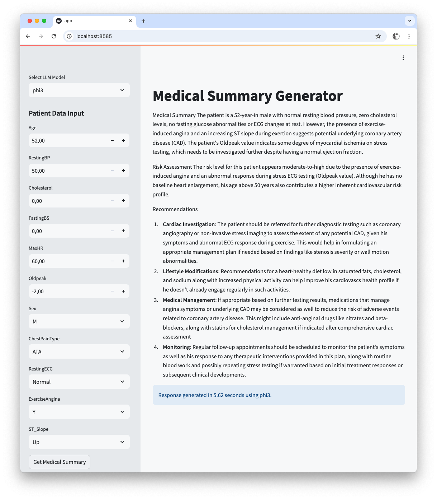
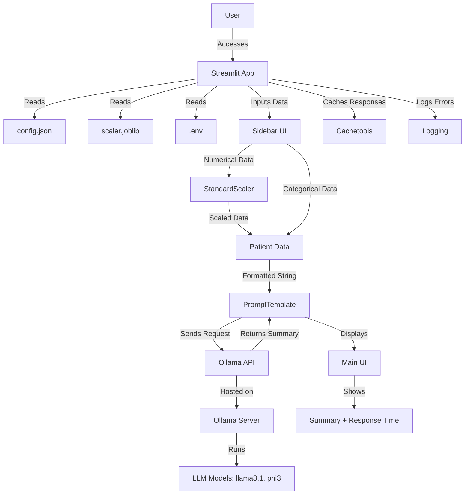
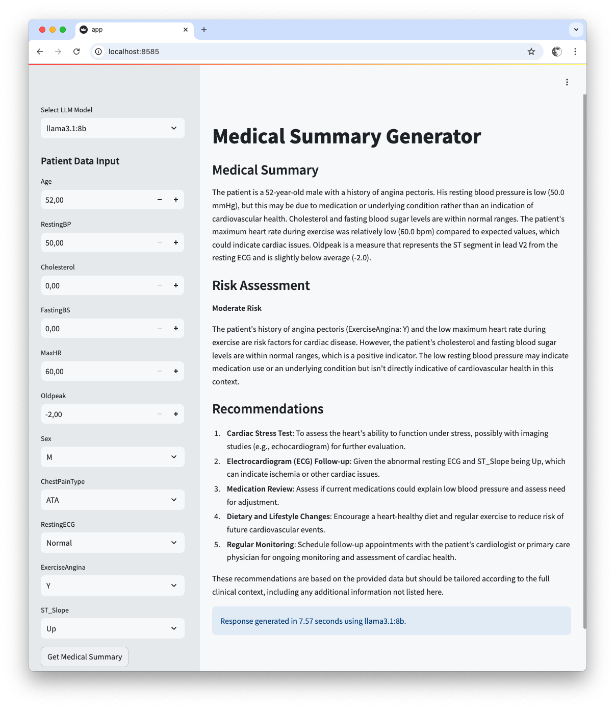
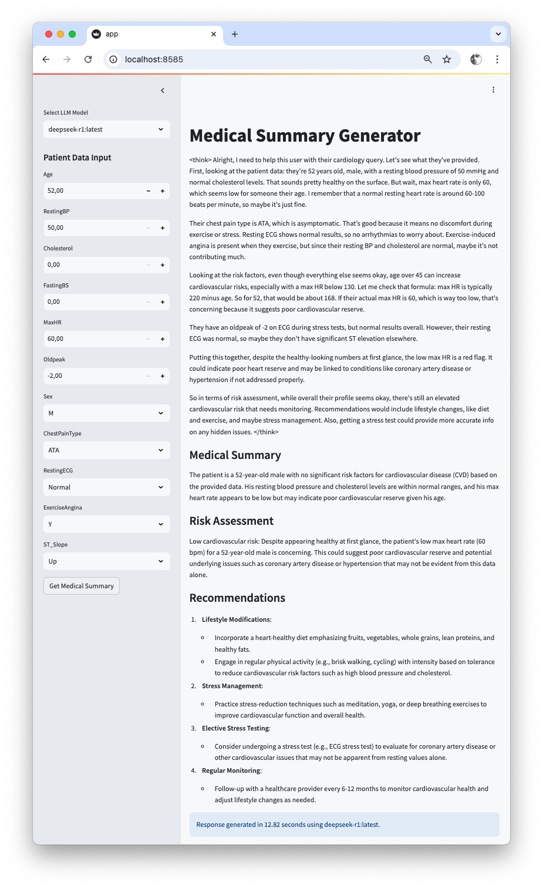
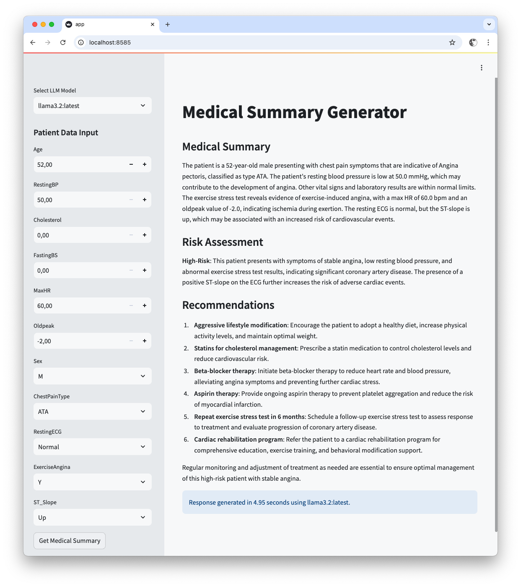

# Medical Summary Generator

## Overview
The Medical Summary Generator is a web-based AI application. A prototype designed to assist healthcare professionals in generating structured medical summaries for cardiology patients. The app collects patient data (numerical and categorical features based on the UCI Heart Disease dataset), preprocesses numerical inputs using a pre-trained StandardScaler, and leverages a large language model (LLM) hosted via the Ollama API to produce summaries with sections for Medical Summary, Risk Assessment, and Recommendations. It includes a response timer to compare LLM performance and supports dynamic model selection through environment variables.



## Features
- **Patient Data Input**: User-friendly interface for entering numerical (e.g., Age, RestingBP) and categorical (e.g., Sex, ChestPainType) data.
- **Data Preprocessing**: Applies a pre-trained StandardScaler to numerical inputs for compatibility with machine learning pipelines.
- **LLM Integration**: Generates structured summaries using Ollama-hosted models (e.g., llama3.1, phi3, deepseek-r1) and every other suitable model that is available via Ollama.
- **Dynamic Model Selection**: Allows users to choose from available Ollama models via a dropdown, configured in `.env`.
- **Response Timer**: Measures and displays LLM inference time, enabling performance comparisons across models.

## Purpose and Approach
This app was developed to provide a simple, scalable, and configurable tool for generating AI-assisted medical summaries in cardiology. Key design choices include:
- **Streamlit for Simplicity**:
  - Streamlit’s intuitive API enables rapid development of interactive web apps with minimal boilerplate, ideal for data-driven applications like this.
  - Its single-page model suits the input-output workflow of collecting patient data and displaying summaries.
- **Ollama API for LLM Inference**:
  - The Ollama API offloads model inference to a separate server, reducing the app’s resource requirements and eliminating the need to download large models locally.
  - It supports a variety of open-source LLMs, allowing flexibility in model selection based on performance and quality.
- **Configuration-Driven Design**:
  - A `config.json` file defines input fields and the LLM prompt, making the app adaptable to other medical domains (e.g., diabetes, cancer risk).
  - Environment variables (.env) configure the Ollama API endpoint and available models, enhancing portability.
- **Docker for Deployment**:
  - Docker ensures consistent environments across development, testing, and production, using a lightweight `python:3.10-slim` base image (~500 MB).
- **Response Timer for Optimization**:
  - The timer facilitates empirical comparison of LLM models, balancing speed and quality, which is critical for healthcare applications requiring timely outputs.

## Benefits
- **User-Friendly**: Streamlit’s clean interface simplifies data entry and result viewing for healthcare professionals.
- **Lightweight**: The Ollama API reduces the app’s resource footprint, making it suitable for modest hardware.
- **Configurable**: Easily adapt to new datasets or models via `config.json` and `.env`.
- **Portable**: Docker ensures consistent deployment across platforms.
- **Performance Tracking**: The response timer helps optimize LLM selection for speed and quality.
- **Robust**: Comprehensive error handling prevents crashes due to invalid inputs, missing files, or API failures.
- **Scalable**: Offloading LLM inference to Ollama allows the app to leverage powerful models on GPU-enabled servers.

## Possible Trade-offs
- **Ollama Dependency**:
  - Requires a running Ollama server, introducing an external dependency that must be managed.
  - Network latency or server downtime could impact performance.
- **Streamlit Limitations**:
  - Streamlit is optimized for single-page apps, limiting support for complex, multi-page workflows.
  - Advanced UI customization requires CSS/JavaScript, which can be fragile.
- **Model Variability**:
  - LLM performance (e.g., llama3.1 vs. phi3) varies in speed and summary quality, necessitating testing to find the best model.
  - Smaller models may produce less detailed outputs than larger ones.
- **Caching**:
  - Response caching improves performance but may return outdated results if inputs change subtly.
  - Cache management adds minor complexity.
- **Healthcare Compliance**:
  - The app lacks encryption, authentication, and audit logging, which are critical for regulated environments like healthcare.

## Architecture and workflow
The following diagram illustrates the app’s architecture and workflow:



## Prerequisites

- **Docker**: Required to build and run the containerized app.
- **Ollama**: A running Ollama server at `http://host.docker.internal:11434` with models pulled (e.g., `ollama pull llama3.1`, `ollama pull phi3`).
- **Hardware**:
  - Host: ~2 GB RAM for the Streamlit container.
  - Ollama server: 4-16 GB RAM (4-8 GB for `phi3`, 8-16 GB for `llama3.1`).
- **Files**:
  - `config.json`: Input fields and prompt.
  - `scaler.joblib`: Pre-trained scaler.
  - `.env`: Ollama configuration.
  - `.streamlit/config.toml`: Streamlit UI settings.

## Dependencies
Specified in requirements.txt:

```text
streamlit==1.38.0
pandas==2.2.3
joblib==1.4.2
cachetools==5.5.0
python-dotenv==1.0.1
langchain==0.3.0
langchain-community==0.3.0
scikit-learn==1.5.2
```

| Library              | Purpose                                                                 |
|----------------------|-------------------------------------------------------------------------|
| `streamlit`          | Builds the interactive web UI.                                          |
| `pandas`             | Creates DataFrames for numerical data preprocessing.                   |
| `joblib`             | Loads the pre-trained `StandardScaler` from `scaler.joblib`.           |
| `cachetools`         | Caches LLM responses to improve performance.                            |
| `python-dotenv`      | Loads environment variables from `.env`.                                |
| `langchain`          | Provides `PromptTemplate` for structuring LLM prompts.                 |
| `langchain-community`| Integrates with the Ollama API for LLM inference.                       |
| `scikit-learn`       | Applies `StandardScaler` for numerical data preprocessing.             |

## Directory Structure

```plaintext
medical-summary-generator/
├── app.py
├── config.json
├── Dockerfile
├── .env
├── generate_scaler.py
├── heart.csv.tar.bz
├── README.md
├── requirements.txt
└── scaler.joblib
└── .streamlit/
    └── config.toml
```

## Setup Instructions for Medical Summary Generator

### 1. Clone the Repository

```bash
git clone https://henrybravo/medical-summary-generator
cd medical-summary-generator
```

### 2. Prepare Configuration Files

#### `config.json`

Defines input fields and prompt. Example:

```json
{
  "domain": "cardiology",
  "numerical": [
    {"name": "Age", "min": 0, "max": 120},
    {"name": "RestingBP", "min": 50, "max": 200},
    {"name": "Cholesterol", "min": 0, "max": 600},
    {"name": "FastingBS", "min": 0, "max": 1},
    {"name": "MaxHR", "min": 60, "max": 220},
    {"name": "Oldpeak", "min": -2, "max": 6}
  ],
  "categorical": [
    {"name": "Sex", "options": ["M", "F"]},
    {"name": "ChestPainType", "options": ["ATA", "NAP", "ASY", "TA"]},
    {"name": "RestingECG", "options": ["Normal", "ST", "LVH"]},
    {"name": "ExerciseAngina", "options": ["Y", "N"]},
    {"name": "ST_Slope", "options": ["Up", "Flat", "Down"]}
  ],
  "prompt_template": "You are an AI assistant specialized in cardiology.\n\nGiven the patient data:\n{patient_data}\n\nProvide a response in the following markdown format:\n### Medical Summary\n[Summary here]\n\n### Risk Assessment\n[Risk level and explanation]\n\n### Recommendations\n[List of recommendations]",
  "scaler_path": "scaler.joblib"
}
```

#### `scaler.joblib`

Generate if missing:

```python
import pandas as pd
from sklearn.preprocessing import StandardScaler
from joblib import dump

# first unpack heart.csv.tar.bz
df = pd.read_csv("heart.csv")
numerical_cols = ["Age", "RestingBP", "Cholesterol", "FastingBS", "MaxHR", "Oldpeak"]
scaler = StandardScaler()
scaler.fit(df[numerical_cols])
dump(scaler, "scaler.joblib")
```

#### `.env` (rename from `env` file)

Configure Ollama:

```env
OLLAMA_BASE_URL=http://host.docker.internal:11434
OLLAMA_AVAILABLE_MODELS=llama3.1,phi3
```

#### `.streamlit/config.toml`

```toml
[server]
enableXsrfProtection = true
enableCORS = false

[browser]
gatherUsageStats = false

[theme]
primaryColor = "#007bff"
backgroundColor = "#f8f9fa"
secondaryBackgroundColor = "#e9ecef"
textColor = "#212529"

[client]
showDeployButton = false
```

### 3. Set Up Ollama

#### Install Ollama

Visit [https://ollama.com](https://ollama.com)


#### Start the server

```bash
ollama serve
```

#### Pull models

```bash
ollama pull llama3.1
ollama pull phi3
```

#### Verify API

```bash
curl http://host.docker.internal:11434/api/tags
# or:
curl http://localhost:11434/api/tags
```

### 4. Build the Docker Image

```bash
docker build -t medical-summary-app .
```

### 5. Run the Container

#### Windows/macOS (Ollama on host)

```bash
docker run -p 8501:8501 medical-summary-app
```

#### Linux (Ollama on host)

```bash
docker run --network=host -p 8501:8501 medical-summary-app
```

> Update `.env`:  
```env
OLLAMA_BASE_URL=http://localhost:11434
```

### Ollama in Docker

```bash
docker network create medical-app-network

docker run -d --network=medical-app-network --name=ollama \
  -v ollama:/root/.ollama -p 11434:11434 ollama/ollama

docker exec ollama ollama pull llama3.1
docker exec ollama ollama pull phi3
```

> Update `.env`:  
```env
OLLAMA_BASE_URL=http://ollama:11434
```

```bash
docker run --network=medical-app-network -p 8501:8501 medical-summary-app
```

### 6. Access the App

Open [http://localhost:8501](http://localhost:8501)

- Enter patient data
- Select an LLM model
- Generate a summary

> 💡 Compare model performance by reviewing response time.

### Screenshots







## Application details
s
```python
import streamlit as st
```

- Imports Streamlit for building the web UI.
- Streamlit simplifies creating interactive apps with a Pythonic API, handling rendering, input widgets, and state management.

```python
import pandas as pd
```

- Imports Pandas for data manipulation.
- Creates a DataFrame for numerical inputs to apply StandardScaler, ensuring compatibility with scikit-learn.

```python
from joblib import load
```

- Imports load to deserialize scaler.joblib.
- joblib efficiently loads the pre-trained StandardScaler saved during training.

```python
from cachetools import cached, TTLCache
```

- Purpose: Imports caching utilities for memoizing LLM responses.
- Why: TTLCache reduces redundant API calls for repeated inputs, improving performance.

```python
from langchain.prompts import PromptTemplate
```

- Imports PromptTemplate for structuring LLM prompts.
- LangChain simplifies prompt creation, allowing dynamic data insertion.

```python
from langchain_community.llms import Ollama
```

- Imports the Ollama client for API interaction.
- Abstracts HTTP requests to the Ollama API, simplifying LLM inference.

```python
numerical_cols = [c["name"] for c in config["numerical"]]
categorical_cols = [c["name"] for c in config["categorical"]]
numerical_ranges = {c["name"]: (c["min"], c["max"]) for c in config["numerical"]}
categorical_options = {c["name"]: c["options"] for c in config["categorical"]}
```

- Purpose: Extracts input field metadata from config.json.
- Why: Dynamically configures input fields, enabling adaptation to different datasets.

```python
try:
    scaler = load(config["scaler_path"])
except FileNotFoundError:
    st.error(f"Error: {config['scaler_path']} file not found. Please ensure it exists.")
    logging.error(f"{config['scaler_path']} file not found.")
    st.stop()
except Exception as e:
    st.error(f"Error loading {config['scaler_path']}: {str(e)}")
    logging.error(f"Error loading {config['scaler_path']}: {str(e)}")
    st.stop()
```

- Loads `scaler.joblib` with error handling.
- Ensures the scaler is available for preprocessing, with clear error messages.

```python
try:
    llm = Ollama(model=selected_model, base_url=OLLAMA_BASE_URL)
except Exception as e:
    st.error(f"Error connecting to Ollama API at {OLLAMA_BASE_URL}: {str(e)}")
    logging.error(f"Error connecting to Ollama API: {str(e)}")
    st.stop()
```

- Initializes the Ollama client with error handling.
- Ensures API connectivity, failing gracefully if unavailable.

```python
prompt = PromptTemplate(
    input_variables=["patient_data"],
    template=config["prompt_template"],
)
```

- Defines the LLM prompt template.
- Structures the prompt with patient data, loaded from `config.json`.

```python
cache = TTLCache(maxsize=100, ttl=3600)
```

- Initializes a cache for 100 entries with a 1-hour TTL.
- Improves performance for repeated inputs.

```python
@cached(cache)
def generate_summary(patient_data_str):
    try:
        response = llm(prompt.format(patient_data=patient_data_str))
        return response
    except Exception as e:
        logging.error(f"Error generating summary: {e}")
        return f"An error occurred: {str(e)}"
```

- Defines a cached function for summary generation.
- Combines LLM inference, caching, and error handling for reliability.

```python
numerical_values = [patient_data[col] for col in numerical_cols]
numerical_df = pd.DataFrame([numerical_values], columns=numerical_cols)
try:
    scaled_array = scaler.transform(numerical_df)
except Exception as e:
    st.error(f"Error scaling data: {str(e)}")
    logging.error(f"Error scaling data: {str(e)}")
    st.stop()
```

- Preprocesses numerical data.
- Scales data to match training, with error handling.


## Production Considerations (Healthcare)

Deploying in a regulated healthcare environment (e.g., **HIPAA**, **GDPR**) requires attention to the following areas:

### Security

- **TLS/SSL**: Use HTTPS via Nginx or similar.
- **Data Privacy**: Disable patient data logging in production.
- **Sanitization**: Validate inputs to prevent injection attacks.

### Compliance

- **HIPAA/GDPR**:
  - Add authentication (e.g., OAuth).
  - Enable audit logging.
- **Model Transparency**:
  - Document limitations of the LLM.
- **Regulatory Approval**:
  - Clinical use may require **FDA approval**.

### Access Control

- Use an identity provider (e.g., **Okta**) for **role-based access**.
- Secure the **Ollama API** with keys or tokens.

### Reliability

- **High Availability**: Deploy multiple Ollama instances with **load balancing**.
- **Scaling**: Use **Kubernetes** for dynamic scaling.
- **Monitoring**: Track system performance using **Prometheus** and **Grafana**.

### Validation

- Validate LLM outputs with **clinical experts**.
- Write automated tests using **pytest**.

### Backup

- Regularly back up:
  - `config.json`
  - `scaler.joblib`
  - Ollama configuration files
- Have a **disaster recovery plan** in place.

## Troubleshooting

- Ollama API:
```bash
curl http://host.docker.internal:11434/api/tags

# or:

curl http://localhost:11434/api/tags
```

- Config Issues:
```bash
python -c "import json; print(json.load(open('config.json')))"
```

- Scaler:
```bash
ls -lh scaler.joblib
```

- Logs:
```bash
docker logs <container_id>
```

## Additional Notes
- **Model Selection**:
  - Use the response timer to compare models (e.g., phi3 for speed, llama3.1 for quality). Update OLLAMA_AVAILABLE_MODELS in .env to add models like mistral or gemma2.
  - Test summary quality with cardiologists to ensure clinical relevance.
- **Performance Optimization**:
  - Adjust the cache TTL (TTLCache) in app.py to balance performance and freshness:
    ```python
    cache = TTLCache(maxsize=100, ttl=3600)  # 1 hour
    ```
- **Disable caching for benchmarking**:
    ```python
    def generate_summary(patient_data_str):  # Remove @cached(cache)
    ```
- **Extending to Other Domains**:
  - Modify config.json to support other datasets (e.g., diabetes, cancer risk) by updating numerical/categorical fields and the prompt template.
  - Example for diabetes:
    ```json
    {
    "domain": "diabetes",
    "numerical": [
        {"name": "Glucose", "min": 0, "max": 400},
        {"name": "BMI", "min": 10, "max": 60}
    ],
    "categorical": [
        {"name": "FamilyHistory", "options": ["Yes", "No"]}
    ],
    "prompt_template": "You are an AI assistant specialized in diabetes...\nGiven the patient data: {patient_data}\nProvide a medical summary..."
    }
    ```

## Future Enhancements
- Log response times for historical analysis.
- Integrate ML models for risk prediction.
- Add authentication.
- Support PDF export.
- Extend to other domains (e.g., diabetes).

## License
MIT License

## Contact
Open a GitHub issue.
